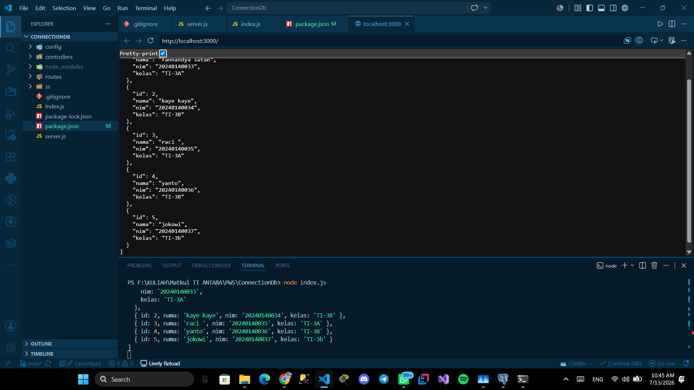
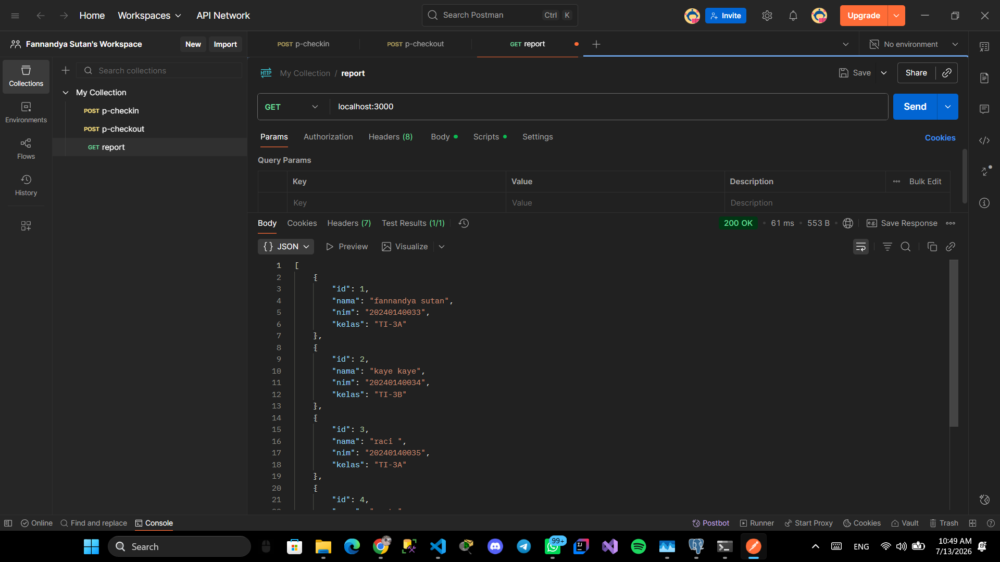

# ConnectionDb

Aplikasi Node.js untuk menghubungkan Express dengan PostgreSQL.

## Tech Stack

- **Runtime:** Node.js
- **Framework:** Express
- **Database:** PostgreSQL
- **Driver:** pg (node-postgres)

## Cara Menjalankan

1. Clone repositori ini
2. Install dependencies:
   ```bash
   npm install
   ```
3. Pastikan PostgreSQL berjalan dan database `mahasiswa` sudah dibuat
4. Jalankan server:
   ```bash
   node index.js
   ```
5. Buka `http://localhost:3000`

## Endpoint

| Method | Route | Deskripsi |
|--------|-------|-----------|
| GET    | `/`   | Mengambil semua data dari tabel `biodata` |

## Screenshot




